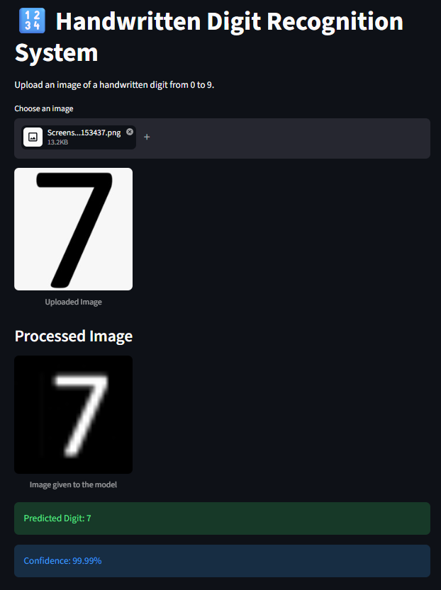
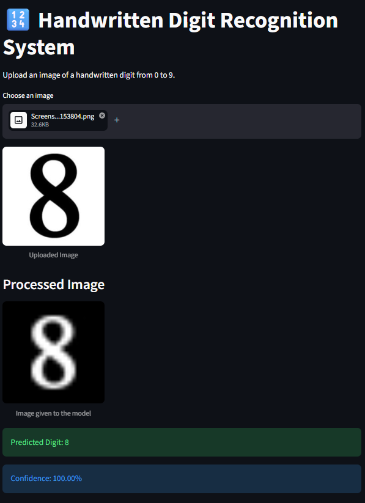

# Handwritten Digit Recognition System

## Project Title
Handwritten Digit Recognition System

## Dataset & Source
- Dataset: MNIST
- Source: TensorFlow/Keras built-in dataset
- Description: The MNIST dataset contains grayscale images of handwritten digits from 0 to 9, each represented as a 28x28 pixel image.

## Problem Statement
Develop a CNN model that recognizes handwritten digits from 0–9. Students should preprocess the images, build and train a CNN, evaluate its performance, save the model, and deploy a Streamlit application where users can upload a handwritten digit image and receive a prediction.

## Project Overview
This project focuses on building a deep learning solution for handwritten digit recognition using a Convolutional Neural Network (CNN). The model is trained on the MNIST dataset and then deployed in a user-friendly Streamlit web application where users can upload an image and get the predicted digit.

## Objectives
- Load and preprocess the MNIST dataset
- Build a CNN model for classification
- Train and evaluate the model
- Save the trained model for reuse
- Create a Streamlit interface for digit prediction
- Test the model using uploaded handwritten digit images

## Tech Stack
- Python
- TensorFlow / Keras
- Streamlit
- NumPy
- PIL (Python Imaging Library)
- Jupyter Notebook

## Project Structure

```text
Project_File_3/
├── README.md
├── 7_prediction.png
├── 8_prediction.png
├── Deep_Learning/
│   ├── app.py
│   ├── digit_model.keras
│   └── Digit_Recognition.ipynb
```

## Model Workflow
1. Import the MNIST dataset from TensorFlow/Keras
2. Normalize the image pixel values to the range [0, 1]
3. Reshape the images to fit the CNN input format
4. Build the CNN architecture using convolution, pooling, and dense layers
5. Train the model until it reaches good accuracy
6. Evaluate the model using test data
7. Save the model as `digit_model.keras`
8. Deploy the app using Streamlit

## Streamlit Application
The application allows a user to upload an image of a handwritten digit, preprocess it, and receive the predicted class along with confidence score.

## Interface and Prediction Examples

### App Interface
#### Prediction Example1


#### Prediction Example1


#### Prediction Example2


## How to Run the Project

### 1. Install Dependencies
Open a terminal and run:

```bash
pip install tensorflow streamlit numpy pillow
```

### 2. Train the Model
Open the notebook:

```text
Deep_Learning/Digit_Recognition.ipynb
```

Train the CNN model and save it as:

```text
Deep_Learning/digit_model.keras
```

### 3. Run the Streamlit App
```bash
cd Deep_Learning
streamlit run app.py
```

Then open the local URL displayed in the terminal in your browser.

## Expected Output
- The application accepts user-uploaded handwritten digit images
- The image is processed and normalized before prediction
- The model predicts the digit from 0 to 9
- The app displays the predicted digit and confidence percentage

## Results
The model is trained to recognize digits with high accuracy using CNN-based feature extraction and classification. Once deployed, it can predict uploaded handwritten digits in real time through the Streamlit user interface.

## Conclusion
This project demonstrates a complete deep learning pipeline for image classification, from dataset preparation and CNN training to model deployment in a web application. It is a practical and effective solution for handwritten digit recognition using modern AI tools.

## References
- TensorFlow MNIST Dataset
- Keras CNN Documentation
- Streamlit Documentation

## Author
Student Project / Deep Learning Assignment
